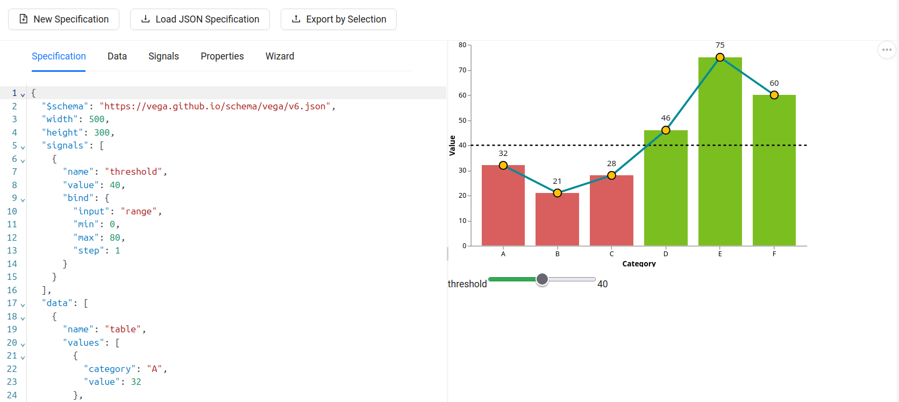

<p align="center">
    
</p>

GUI 4 Vega is a React component library that provides a user-friendly interface for creating and customizing Vega visualizations.



## Features

## Requirements

## Installation

## User Guide

### Editor

### Library

```bash
cd gui4vega_react
npm install
npm run build
```

### Run demo applications

```bash
cd demo_antd    # or demo_bootstrap
npm install
npm run dev
 ```

## Known Issues and Limitations